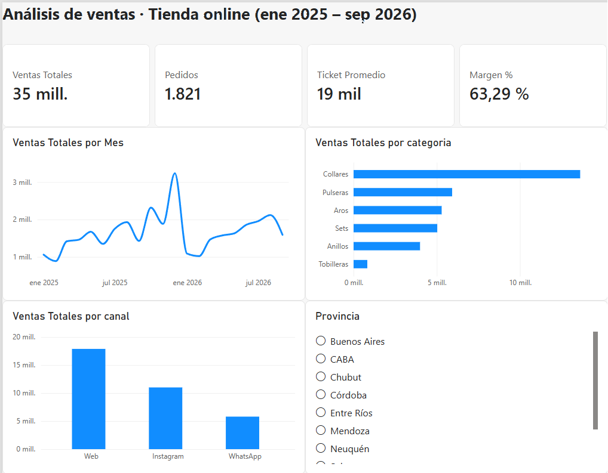

# Análisis de ventas · Tienda online de bijouterie

Tablero en **Power BI** que analiza 21 meses de ventas (enero 2025 – septiembre 2026) de una tienda online, para responder qué vende, dónde, por qué canal y cómo evoluciona el negocio.



> **Nota:** los datos son ficticios, generados para practicar. Simulan una tienda online argentina con 1.821 pedidos, 20 productos y 420 clientes.

---

## Preguntas de negocio

1. ¿El negocio está creciendo? ¿Hay estacionalidad?
2. ¿Qué categorías y productos generan más ingresos?
3. ¿Qué canal vende más: Web, Instagram o WhatsApp?
4. ¿En qué provincias se concentran las ventas?
5. ¿Cuánto gasta cada cliente por pedido y cuánto margen deja?

## Resultados principales

| Indicador | Valor |
|---|---|
| Ventas totales | $34,7 millones |
| Pedidos | 1.821 |
| Ticket promedio | $19.048 |
| Margen bruto | 63,3 % |

## Hallazgos y recomendaciones

**1. El negocio crece un 10 % interanual.**
Enero–septiembre 2026 facturó $14,3 millones contra $12,95 millones en el mismo período de 2025 (+10,4 %).
Ojo: el total anual de 2026 parece menor que el de 2025, pero es porque 2026 todavía no tiene octubre a diciembre, que son los meses más fuertes. Comparar el mismo período evita esa conclusión equivocada.

**2. Fuerte estacionalidad: octubre y diciembre son los meses clave.**
Diciembre 2025 fue el pico ($3,24 millones, casi el doble de un mes promedio) por las fiestas, y octubre muestra otro pico por el Día de la Madre. Enero y febrero son los meses más bajos.
→ *Recomendación:* aumentar stock y preparar campañas en septiembre y noviembre. Usar enero y febrero para liquidar stock con descuentos, sabiendo que la caída es estacional y no una crisis.

**3. Collares es el 39 % de la facturación.**
Los tres productos más vendidos son collares. Pero Aros vende casi las mismas unidades (638 contra 665) y factura menos de la mitad, porque su precio es más bajo.
→ *Recomendación:* aprovechar el volumen de Aros para vender más caro, ofreciendo el set de collar + aros a quien compra aros.

**4. La web vende la mitad (52 %), Instagram un tercio (32 %).**
El ticket promedio es parecido en los tres canales (entre $18.000 y $19.600), así que la diferencia está en la cantidad de pedidos, no en cuánto gasta cada cliente.
→ *Recomendación:* usar Instagram como vidriera que lleve tráfico a la web, que es donde más se concreta la compra.

**5. Buenos Aires y CABA concentran el 55 % de las ventas.**
Algunas provincias del interior (Córdoba, Entre Ríos, Chubut) muestran un ticket más alto, cercano a $21.000. Como tienen pocos pedidos, es una señal para seguir mirando, no una conclusión firme.

**6. El margen es sano y parejo.**
Todas las categorías dejan entre 62 % y 67 % de margen, así que ninguna está "regalando" ganancia.

## Cómo lo hice

1. **Datos:** 3 tablas en Excel (ventas, productos y clientes).
2. **Limpieza en Power Query:** corrección de tipos de datos (fechas que venían como números, precios y costos).
3. **Modelado:** relaciones uno a varios entre ventas, productos y clientes (modelo estrella).
4. **Medidas DAX:**

```DAX
Ventas Totales = SUMX(ventas, ventas[cantidad] * RELATED(productos[precio]))
Pedidos = COUNTROWS(ventas)
Ticket Promedio = DIVIDE([Ventas Totales], [Pedidos])
Costo Total = SUMX(ventas, ventas[cantidad] * RELATED(productos[costo]))
Margen = [Ventas Totales] - [Costo Total]
Margen % = DIVIDE([Margen], [Ventas Totales])
```

5. **Tablero:** indicadores clave, evolución mensual, ventas por categoría y por canal, y filtro por provincia. Todos los gráficos se filtran entre sí.

## Herramientas

Power BI Desktop · Power Query · DAX · Excel

## Archivos

- `Tablero_Ventas.pbix` — archivo de Power BI
- `Tablero_Ventas.pdf` — tablero exportado
- `Tienda_Bijou_datos.xlsx` — datos usados
